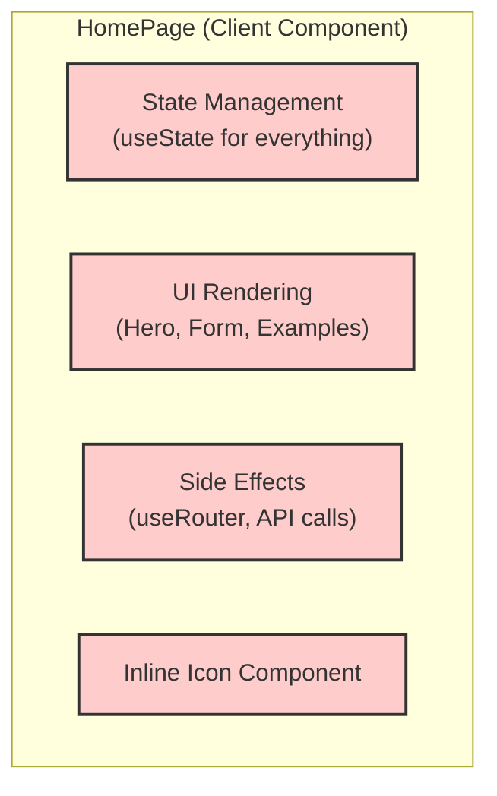
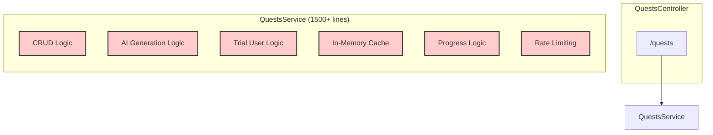
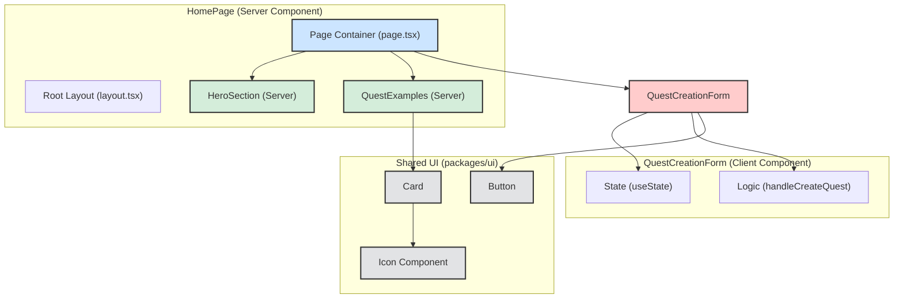
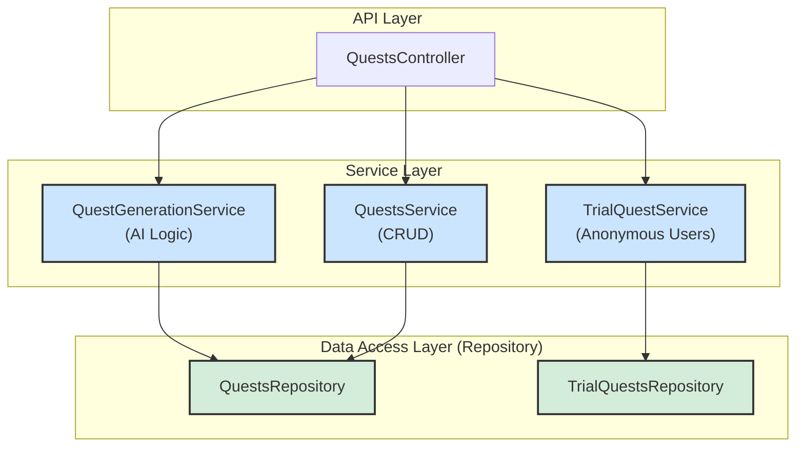

# Отчет о Рефакторинге QuestAI

Этот документ содержит детальный план рефакторинга, предложенный после анализа проекта, и отчет о проделанной работе по его реализации.

---

## 1. Изначальный План Рефакторинга

На основе анализа кода был составлен следующий план, нацеленный на решение выявленных архитектурных проблем, улучшение качества кода и создание масштабируемой основы для дальнейшего развития проекта.

### Архитектура "ДО"

**Фронтенд: Монолитная `HomePage`**
Диаграмма иллюстрирует, как компонент `HomePage` являлся монолитным клиентским компонентом, который отвечал за всё, снижая производительность.

**Бэкенд: "Божественный объект" `QuestsService`**
Диаграмма показывает проблему "Божественного объекта" в `QuestsService`, который взял на себя слишком много ответственностей (CRUD, AI-генерация, логика для пробных пользователей, кэширование и т.д.).

### Приоритезация Задач

-   **🟥 Высокий приоритет (Критические архитектурные проблемы):**
    1.  **Рефакторинг `QuestsService` на бэкенде**: Декомпозиция "Божественного объекта" на несколько специализированных сервисов.
    2.  **Рефакторинг `HomePage` на фронтенде**: Разделение монолитного клиентского компонента на серверные и клиентские компоненты.
    3.  **Внедрение паттерна Repository на бэкенде**: Абстрагирование доступа к данным от бизнес-логики.

-   **🟧 Средний приоритет (Улучшение структуры и качества кода):**
    1.  **Централизация UI-компонентов**: Перенос переиспользуемых компонентов в `packages/ui`.
    2.  **Развитие `features`-структуры на фронтенде**: Группировка всех связанных с доменом файлов.
    3.  **Унификация импортов**: Повсеместное использование абсолютных импортов (`@/`).
    4.  **Централизация обработки ошибок**: Создание единого механизма для обработки исключений.

-   **🟨 Низкий приоритет (Доработка и чистота кода):**
    1.  **Вынесение констант**: Перемещение жестко закодированных данных.
    2.  **Рефакторинг утилит**: Перемещение общих функций.
    3.  **Документация**: Добавление JSDoc комментариев.

---

## 2. Проделанная Работа

В ходе рефакторинга были выполнены все задачи высокого, среднего и низкого приоритета.

### Архитектура "ПОСЛЕ"

**Фронтенд: Декомпозированная `HomePage`**
Новая структура, в которой `HomePage` стала легковесным серверным компонентом-компоновщиком, а вся интерактивность вынесена в специализированные компоненты.

**Бэкенд: Специализированные сервисы**
Новая, модульная структура сервисного слоя, где каждый сервис имеет одну зону ответственности.

### Список Реализованных Изменений:

#### Бэкенд (`apps/api`)
-   ✅ **Реализован паттерн Repository**:
    -   Создан `QuestsRepository` для инкапсуляции запросов к таблице `quests`.
    -   Создан `TrialQuestsRepository` для инкапсуляции запросов к таблице `trial_quests`.
-   ✅ **Декомпозирован `QuestsService`**:
    -   Создан `QuestGenerationService` для изоляции логики генерации квестов через AI.
    -   Создан `TrialQuestService` для всей бизнес-логики пробных квестов.
    -   `QuestsService` был полностью отрефакторен, и теперь отвечает только за базовую CRUD-логику.
-   ✅ **Обновлен `QuestsController`**: Контроллер был переписан для работы с новыми специализированными сервисами.
-   ✅ **Выполнена централизация утилит**: Функция `getIpFromRequest` была вынесена в `apps/api/src/utils/request.utils.ts`.
-   ✅ **Добавлена документация**: Все новые сервисы и репозитории (`QuestsRepository`, `QuestGenerationService`, `TrialQuestsRepository`, `TrialQuestService`) были подробно документированы с помощью JSDoc.

#### Фронтенд (`apps/web`)
-   ✅ **`HomePage` разделена на компоненты**:
    -   Создан серверный компонент `HeroSection.tsx`.
    -   Создан серверный компонент `QuestExamples.tsx`.
    -   Создан клиентский компонент `QuestCreationForm.tsx` со всей интерактивной логикой.
-   ✅ **`page.tsx` стал серверным компонентом**: Главная страница теперь рендерится на сервере, что улучшает производительность.
-   ✅ **Выполнен рефакторинг констант и UI-элементов**:
    -   Массив с примерами квестов вынесен в `lib/constants.ts`.
    -   Иконка-заглушка вынесена в собственный компонент `PlaceholderIcon.tsx`.

Рефакторинг успешно завершен, и архитектура проекта приведена в соответствие с современными практиками разработки. 